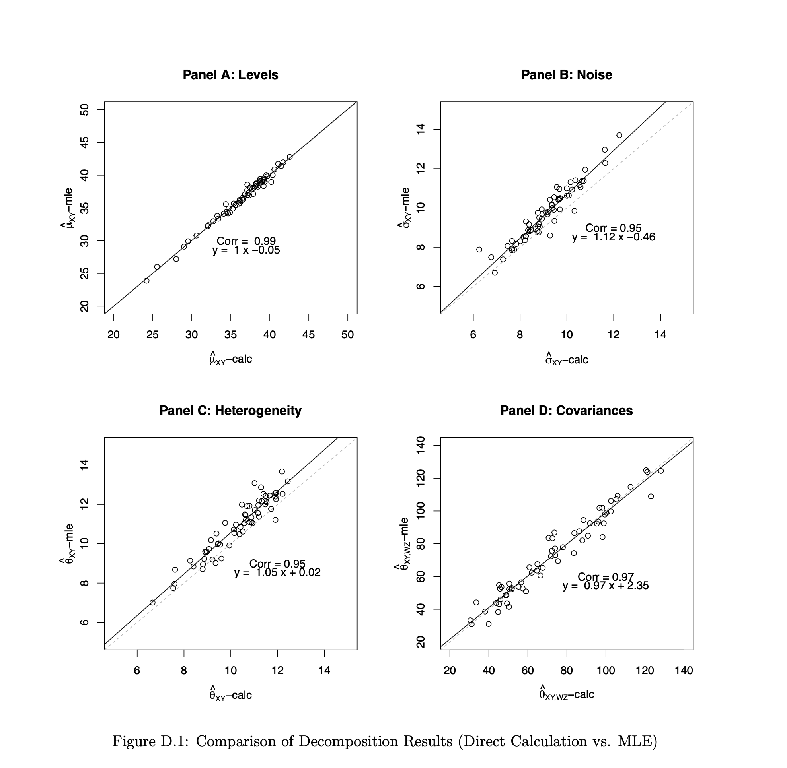
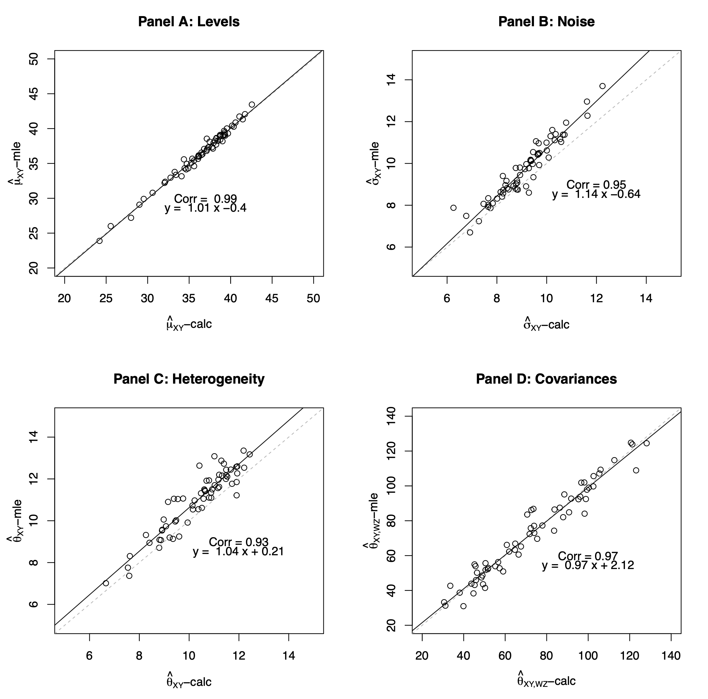
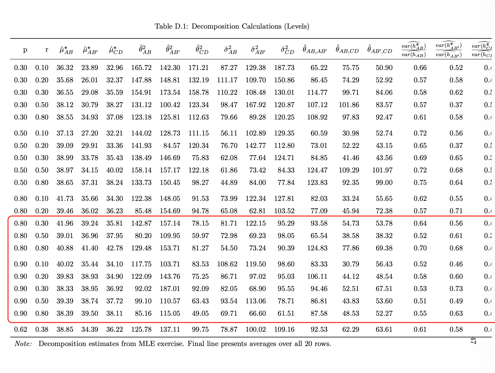
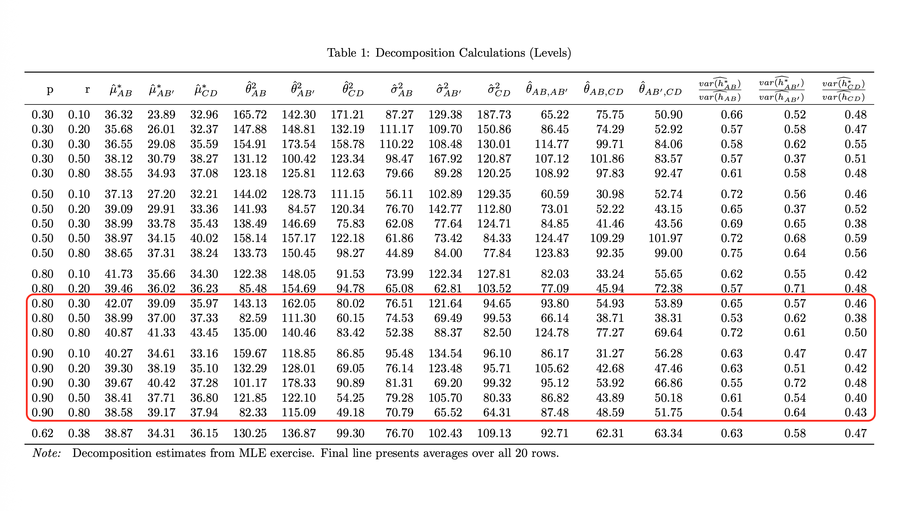
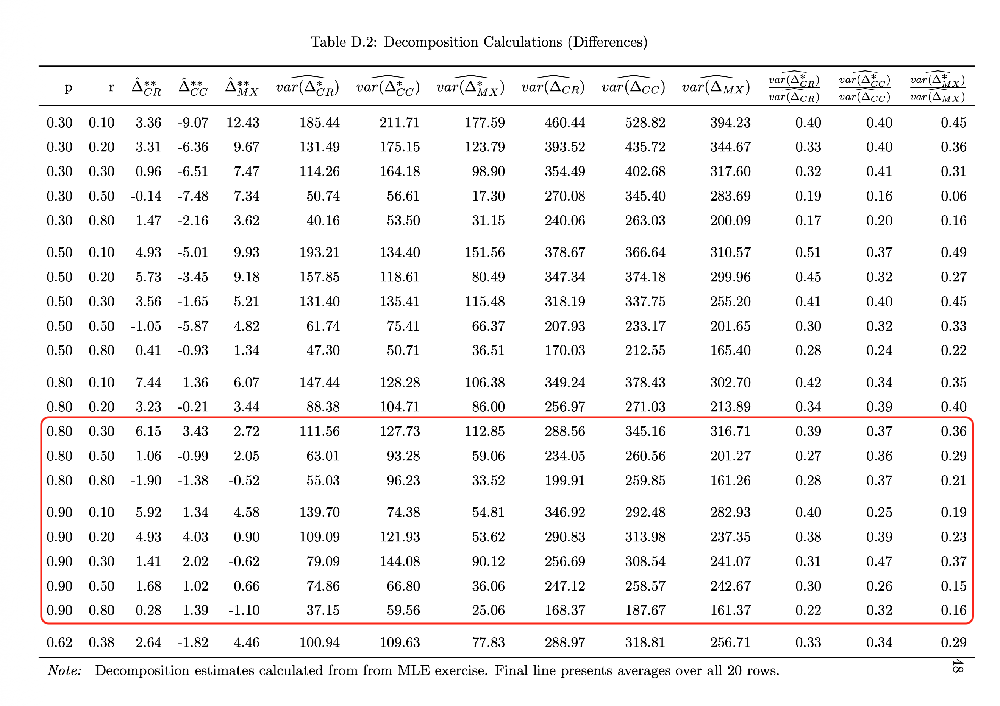
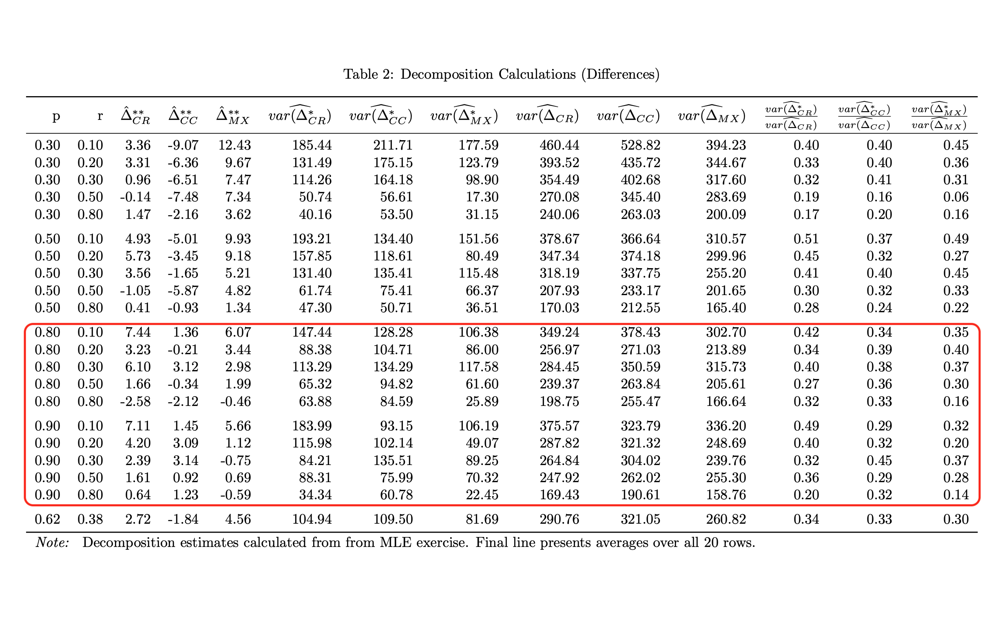

# Paper Identification

|  |   |
| ---  |  -------|
| ID  |   |
| Author  |   |
| Title  |   |
| Iteration |   |


Some useful information up front:

- [JPE Data and Code Availability Policy](https://www.journals.uchicago.edu/journals/jpe/datapolicy)
- [Step by step guidance from Data Editor for Authors](https://jpedataeditor.github.io/) 
- [Template README](https://social-science-data-editors.github.io/template_README/)


# Summary

In assessing compliance with our [Data and Code Availability Policy](https://www.journals.uchicago.edu/journals/jpe/datapolicy), our reproducibility team has identified the following issues, which we ask you to address:

# General

- [x] Data Availability and Provenance Statements
  - [x] Statement about Rights - Part 1: Right to use the data (e.g. *did the authors lawfully obtain the data*)
  - [x] Statement about Rights - Part 2: Right to publish the data (e.g. *are human subjects involved and did permission been granted to publish their data?*)
  - [x] License for Data (optional, but recommended)
  - [x] Details on each Data Source
- [x] Dataset list
- [x] Computational requirements
  - [x] Software Requirements
  - [x] Controlled Randomness (as necessary)
  - [x] Memory, Runtime, and Storage Requirements
- [x] Description of programs/code
  - [x] License for Code (Optional, but recommended) 
- [x] List of tables and programs
- [x] References (Optional, but recommended) 


# High-level Description of Research Project

*This research project...*

- [ ] uses observational data.
- [ ] uses *confidential* observational data.
- [x] uses data generated via experiment or trial by the authors (in field or lab).
  - [ ] For lab experiments: The code to implement the experimental protocol (z-Tree, o-Tree etc) is included in the package.
  - [x] A PDF copy of IRB approval is contained in the package.
  - [ ] A PDF document outlining the design of the experiment, including information on the selection and eligibility of participants is included.
    - [x] Details outlining the design of the experiment, including information on the selection and eligibility of participants is included in the README.
  - [x] A PDF copy of the instructions given to participants in both original language and an English translation is included.
- [x] uses data generated via survey by the authors (in field or online)
  - [x] The programs used to administer the survey (e.g. qualtrics survey file) are included.
  - [x] A PDF copy of IRB approval is contained in the package.
  - [x] A PDF of the original questionaire(s) and information on the selection and eligibility of participants is included.
- [ ] is a simulation study: the data are generated by an algorithm.
- [ ] is a numerical illustration: no data are used but code is used to produce illustrative output (tables, figures)


# Data description

## Data Sources

| file/name            | public | private | DOI/URL | Access described| cited readme | cited paper |
| ----                 | ---    | ---     | ---     | ---             | ----         | ----        | 
| raw-data/qualtrics-raw.csv | yes    | no      | no     | no              | yes          | no         |
| raw-data/demographics-anonymized.csv         | yes    | no      | no     | no              | yes          | no         |
| raw-data/Published-Blat-CCE-data-2022-AEJMicro.csv                  | yes     | no      | no     | yes              | yes          | yes          |
| raw-data/Published-Blat-CRE-data-2023-EE.csv                  | yes     | no      | no     | yes              | yes          | yes
| raw-data/[dataset]_definitions.csv  | yes | no | no | no | no | no |

### Qualtrics Data

- [x] Dataset is provided in public deposit
- [ ] Dataset is PRIVATELY provided (not for publication)
- [ ] DOI or URL is provided, and works
- [ ] Access conditions are described:
  - Primary data collected by the authors
- [ ] Data are not cited, but a working paper, article, or other document is cited (not a data citation)
- [x] Data are cited
  - [ ] in the manuscript
  - [x] in the README:

> (Primary data) Author-collected online experiment programmed in Qualtrics and administered to participants recruited on Prolific (October 5, 2022; see experimental documentation in experimental-materials/ and the pre-registration listed above). Raw data: raw-data/qualtrics-raw.csv and raw-data/demographics-anonymized.csv.

### Anonymized Demographics

- [x] Dataset is provided in public deposit
- [ ] Dataset is PRIVATELY provided (not for publication)
- [ ] DOI or URL is provided, and works
- [ ] Access conditions are described:
  - Primary data collected by the authors
- [ ] Data are not cited, but a working paper, article, or other document is cited (not a data citation)
- [x] Data are cited
  - [ ] in the manuscript
  - [x] in the README:

> (Primary data) Author-collected online experiment programmed in Qualtrics and administered to participants recruited on Prolific (October 5, 2022; see experimental documentation in experimental-materials/ and the pre-registration listed above). Raw data: raw-data/qualtrics-raw.csv and raw-data/demographics-anonymized.csv.

### Dataset Definitions


- [x] Dataset is provided in public deposit
- [ ] Dataset is PRIVATELY provided (not for publication)
- [ ] DOI or URL is provided, and works
- [ ] Access conditions are described:
  - Author generated defintions for variables
- [ ] Data are not cited, but a working paper, article, or other document is cited (not a data citation)
- [ ] Data are cited
  - [ ] in the manuscript
  - [ ] in the README

### Published-Blat-CCE-data-2022-AEJMicro.csv

- [x] Dataset is provided in public deposit
- [ ] Dataset is PRIVATELY provided (not for publication)
- [ ] DOI or URL is provided, and works
- [x] Access conditions are described:
  - Created from tables included in previously published journal papers.
  - Included in the data section to match the README
- [x] Data are not cited, but a working paper, article, or other document is cited (not a data citation)
- [x] Data are cited
  - [x] in the manuscript
  - [x] in the README

> Blavatskyy, P., Ortmann, A., & Panchenko, V. (2022). On the experimental robustness of the Allais paradox. American Economic Journal: Microeconomics, 14(1), 143–163.

### Published-Blat-CRE-data-2022-EE.csv

- [x] Dataset is provided in public deposit
- [ ] Dataset is PRIVATELY provided (not for publication)
- [ ] DOI or URL is provided, and works
- [x] Access conditions are described:
  - Created from tables included in previously published journal papers. Authors made minor corrections that are described in the README.
  - Included in the data section to match the README
- [x] Data are not cited, but a working paper, article, or other document is cited (not a data citation)
- [x] Data are cited
  - [x] in the manuscript
  - [x] in the README

> Blavatskyy, P., Panchenko, V., & Ortmann, A. (2023). How common is the common-ratio effect? Experimental Economics, 26(2), 253–272.


# Requirements 
- [x] README is in TXT, MD, or PDF format
- [x] README is accessible at the root of the package (not inside a folder)
- [x] Title conforms to guidance (starts with "Data and Code for: Title of Paper" or "Code for: Title of Paper", is properly capitalized)
- [x] Authors (with affiliations) are listed in the same order as on the paper

## Stated Requirements

- [ ] No requirements specified
- [x] Software Requirements specified as follows:
  - Stata MP 19.5
    - Stata Packages: estout, unique, binscatter
  - Matlab: 25.1.0.2943329 (R2025a)
  - R version 4.5.1
    - R packages: stats4, mvtnorm, dplyr, kableExtra
- [x] Computational Requirements specified as follows:
  - <25MB of storage space required
- [x] Time Requirements specified as follows:
  - <10 minutes for Stata/Matlab-only
  - 10-120 minutes for full replication including R

- [x] Requirements are complete.


# Analyzing Data and Code Files












## Code description




- [x] The replication package contains a "main" or "master" file(s) which calls all other auxiliary programs.
- There are six provided R files, four main and 11 function Matlab .m files, and 7 stata .do files
- Table 1, Table 3 and Figure 2 were made by the authors directly. There is no corresponding code file
- In-text numbers are not listed in the README, but a .do file is provided to replicate.

## Computing Environment of the Replicator

- Nuvolos Cloud Server, "Ubuntu 22.04.3 LTS", Intel(R) Xeon(R) Platinum 8370C CPU @ 2.80GHz, 4 core, 16-GB RAM
- R version 4.5.1
- MATLAB 2025a
- STATA MP 19.5

```bash
R version 4.5.1 (2025-06-13)
Platform: x86_64-pc-linux-gnu
Running under: Ubuntu 22.04.4 LTS

Matrix products: default
BLAS:   /usr/lib/x86_64-linux-gnu/openblas-pthread/libblas.so.3 
LAPACK: /usr/lib/x86_64-linux-gnu/openblas-pthread/libopenblasp-r0.3.20.so;  LAPACK version 3.10.0

locale:
 [1] LC_CTYPE=en_US.UTF-8       LC_NUMERIC=C               LC_TIME=en_US.UTF-8       
 [4] LC_COLLATE=en_US.UTF-8     LC_MONETARY=en_US.UTF-8    LC_MESSAGES=en_US.UTF-8   
 [7] LC_PAPER=en_US.UTF-8       LC_NAME=C                  LC_ADDRESS=C              
[10] LC_TELEPHONE=C             LC_MEASUREMENT=en_US.UTF-8 LC_IDENTIFICATION=C       

time zone: Etc/UTC
tzcode source: system (glibc)

attached base packages:
[1] stats     graphics  grDevices utils     datasets  methods   base     

loaded via a namespace (and not attached):
 [1] digest_0.6.37     R6_2.6.1          fastmap_1.2.0     xfun_0.52         cachem_1.1.0     
 [6] knitr_1.50        htmltools_0.5.8.1 rmarkdown_2.29    lifecycle_1.0.4   cli_3.6.5        
[11] sass_0.4.10       jquerylib_0.1.4   rsconnect_1.5.0   compiler_4.5.1    rstudioapi_0.17.1
[16] tools_4.5.1       evaluate_1.0.4    bslib_0.9.0       yaml_2.3.10       jsonlite_2.0.0   
[21] rlang_1.1.6    
```


# Replication

- Downloaded code and paper from Dropbox and GitHub to Nuvolos
- Changed STATA working directory byt replacing:
```Stata
local folder "Desktop/replication_files" // update based on local directory (e.g. Desktop/replication_files)
	global user  "`c(username)'"
	if "`c(os)'" == "Windows" {
		global dir "C:/Users/$user/`folder'"	
	}
	else if "`c(os)'" == "MacOSX" {
		global dir "/Users/$user/`folder'"
	}
```
with
```Stata
global dir "/files/JPE-Sprenger-20250266/replication-package/replication_filesv2"
```
- Stata output ran with no other changes.
- Ran Matlab code as per instructions after changing directories. Worked without any further inputs.
- Ran R code as per instructions after changing directories. Worked without any further inputs. 

# Findings {#sec-findings}
- All outputs were reproduced. No code was provided for Table 1, Figure 2, and Table 3 since these were not computations.
- Tables D1, D2 and Figure D1 had different numbers for certain parameters (error was < 1.0, probably a computational issue)
- Data includes Personally Identifiable Information (PII) but PII has been anonymized to prevent identification. IRB approval included in the replication package.

## Tables and Figures

| Data Preparation Program | Dataset created                          | Reproduced? |
|--------------------------|------------------------------------------|-------------|
| clean_data.do            | cleaned-data/ExperimentData.dta and .csv |             |
| clean_data.do            | cleaned-data/demographics.dta and .csv   |             |
| clean_data.do            | cleaned-data/part1_cleaned.dta and .csv  |             |
| clean_data.do            | cleaned-data/part2_cleaned.dta and .csv  |             |
| clean_data.do            | cleaned-data/[dataset]_definitions.csv   |             |

| Figure/Table # | Program                      | Line Number | Reproduced? |
|----------------|------------------------------|-------------|-------------|
| Table 1        | Made by Authors              | N/A         | N/A         |
| Table 2        | stata/makeTable2.do          | 91          | yes         |
| Table 3        | Made by Authors              | N/A         | N/A         |
| Figure 1       | matlab/makeFigure1.m         | 133         | yes         |
| Figure 2       | Made by Authors              | N/A         | N/A         |
| Figure 3       | stata/makeFigures3–7.do      | 16          | yes         |
| Figure 4       | stata/makeFigures3–7.do      | 37          | yes         |
| Figure 5       | stata/makeFigures3–7.do      | 64          | yes         |
| Figure 6       | stata/makeFigures3–7.do      | 143         | yes         |
| Figure 7       | stata/makeFigures3–7.do      | 222         | yes         |
| Figure 8       | matlab/structuralEstimates.m | 313         | yes         |
| Figure 9       | matlab/makeFigure9.m         | 146         | yes         |
| Table A.1      | stata/makeAppendixTables.do  | 21          | yes         |
| Table A.2      | stata/makeAppendixTables.do  | 69          | yes         |
| Table A.3      | stata/makeAppendixTables.do  | 92          | yes         |
| Table A.4      | stata/makeAppendixTables.do  | 112         | yes         |
| Table A.5      | stata/makeAppendixTables.do  | 154         | yes         |
| Table A.6      | stata/makeAppendixTables.do  | 178         | yes         |
| Table A.7      | stata/makeAppendixTables.do  | 207         | yes         |
| Table A.8      | stata/makeAppendixTables.do  | 290         | yes         |
| Table A.9      | stata/makeAppendixTables.do  | 436         | yes         |
| Figure A.1     | stata/makeAppendixFigures.do | 17          | yes         |
| Figure A.2     | stata/makeAppendixFigures.do | 70          | yes         |
| Figure A.3     | stata/makeAppendixFigures.do | 119         | yes         |
| Figure A.4     | stata/makeAppendixFigures.do | 171         | yes         |
| Figure A.5     | matlab/structuralEstimates.m | 350         | yes         |
| Table C.1      | stata/makeAppendixTables.do  | 509         | yes         |
| Figure C.1     | stata/makeAppendixFigures.do | 222         | yes         |
| Figure D.1     | R/makeFigureD1.R             | 7           | yes         |
| Table D.1      | R/makeTableD1.R              | 28          | yes         |
| Table D.2      | R/makeTableD2.R              | 27          | yes         |
| Figure E.1     | matlab/makeFigureE1.m        | 65          | yes         |
| Figure F.1     | matlab/structuralEstimates.m | 354         | yes         |
| Figure F.2     | matlab/structuralEstimates.m | 350         | yes         |
| Figure F.3     | matlab/structuralEstimates.m | 352         | yes         |
| Table F.1      | matlab/structuralEstimates.m | 426         | yes         |
| Figure G.1     | matlab/structuralEstimates.m | 813         | yes         |
| Figure G.2     | matlab/structuralEstimates.m | 813         | yes         |
| Figure G.3     | matlab/structuralEstimates.m | 813         | yes         |
| Figure G.4     | matlab/structuralEstimates.m | 813         | yes         |
| Figure G.5     | matlab/structuralEstimates.m | 813         | yes         |
| Figure G.6     | matlab/structuralEstimates.m | 813         | yes         |
| Table G.1      | matlab/structuralEstimates.m | 543         | yes         |

| In-text claim                                                    | Program        | Line Number | Reproduced? |
|------------------------------------------------------------------|----------------|-------------|-------------|
| p. 11: 48 (34%) of 143 CR experiments use KT parameters          | statsInText.do | 20          | Yes         |
| p. 11: 34 (42%) of 81 CC experiments use Allais parameters       | statsInText.do | 20          | Yes         |
| p. 19: Average bonus payment $15.76                              | statsInText.do | 20          | Yes         |
| p. 24: 21.0% of observations exhibit CR+CC                       | statsInText.do | 37          | Yes         |
| p. 24: 14.6% exhibit modal pattern                               | statsInText.do | 47          | Yes         |
| p. 24 (fn 31): 28.9% exhibit CR+CC near canonical parameters     | statsInText.do | 47          | Yes         |
| p. 24 (fn 31): 13.9% exhibit CR-RCC-MX near canonical parameters | statsInText.do | 47          | Yes         |
| p. 24 (fn 31): 21.4% exhibit CR-RCC-MX at small p and small r    | statsInText.do | 47          | Yes         |
| p. 25 (fn 33): ~10% of observations at price list boundaries     | statsInText.do | 91          | Yes         |
| p. 26 (fn 38): 26% of response patterns are intransitive         | statsInText.do | 104         | Yes         |
| p. 26 (fn 38): 1.9% average per intransitive pattern             | statsInText.do | 104         | Yes         |
| p. 26 (fn 38): Only 2 intransitive patterns exceed 3%            | statsInText.do | 104         | Yes         |
| p. 27: 73% of simulated preferences in 4 strict patterns         | statsInText.do | 132         | Yes         |
| p. 27: 44% of raw responses in 4 strict patterns                 | statsInText.do | 132         | Yes         |
| p. 27: 8% of simulated preferences in 3 weak patterns            | statsInText.do | 132         | Yes         |
| p. 27: 11% of raw responses in 3 weak patterns                   | statsInText.do | 132         | Yes         |
| p. 27: 81% of simulated preferences in 7 marked patterns         | statsInText.do | 132         | Yes         |
| p. 27: 55% of raw responses in 7 marked patterns                 | statsInText.do | 132         | Yes         |
| p. 32: 19% of simulated preferences in other 6 patterns          | statsInText.do | 175         | Yes         |
| p. 32: 18% of raw responses in other 6 transitive patterns       | statsInText.do | 175         | Yes         |
| p. 33: ~13% of observations exhibit risk tolerance               | statsInText.do | 202         | Yes         |
| p. 33: 55% of risk-tolerant exhibit RCRP                         | statsInText.do | 202         | Yes         |
| p. 33: 87% of observations exhibit risk aversion                 | statsInText.do | 202         | Yes         |
| p. 33: 69% of risk-averse exhibit CRP                            | statsInText.do | 202         | Yes         |
| p. 33: Fisher p < 0.001 (Risk Aversion x CRP)                    | statsInText.do | 202         | Yes         |
| p. 33: 48% of risk-tolerant exhibit P1                           | statsInText.do | 202         | Yes         |
| p. 33: 21% of risk-averse exhibit P1                             | statsInText.do | 202         | Yes         |
| p. 33: Fisher p < 0.001 (Risk Aversion x P1)                     | statsInText.do | 202         | Yes         |
| p. 33: 69% of risk-averse exhibit P2/P3/P4                       | statsInText.do | 202         | Yes         |
| p. 33: 45% of risk-tolerant exhibit P2/P3/P4                     | statsInText.do | 202         | Yes         |
| p. 33: Fisher p < 0.001 (Risk Aversion x P2/P3/P4)               | statsInText.do | 202         | Yes         |

- Figure 1, 5 and 6: No labels, output same.
- Figure 2: no program provided
- Figure A1 - A3: same issue as Figure 6, image not provided for brevity
- Figure D1: slightly different from the paper (possibly computational differences). Comparison below:
::: {#fig-three layout-ncol=2}





:::

- Tables D1 and D2 have slight mismatch between numbers when $p$ is high. Outputs are marked below:

::: {#fig-three layout-ncol=2}





:::

::: {#fig-three layout-ncol=2}




:::

- Other figures and tables match the reported output in the paper

## In-Text Numbers

- [x] In-text numbers verified.

# Classification

- [ ] full reproduction
- [x] full reproduction with minor issues
- [ ] partial reproduction (see above)
- [ ] not able to reproduce most or all of the results (reasons see above)

## Reason for incomplete reproducibility

- [x] None.
- [ ] `Discrepancy in output` (either figures or numbers in tables or text differ)
- [ ] `Bugs in code` that were fixable by the replicator (but should be fixed in the final deposit)
- [ ] `Code missing`, in particular if it prevented the replicator from completing the reproducibility check
  - [ ] `Data preparation code missing` should be checked if the code missing seems to be data preparation code
- [ ] `Code not functional` is more severe than a simple bug: it prevented the replicator from completing the reproducibility check
- [ ] `Software not available to replicator` may happen for a variety of reasons, but in particular (a) when the software is commercial, and the replicator does not have access to a licensed copy, or (b) the software is open-source, but a specific version required to conduct the reproducibility check is not available.
- [ ] `Insufficient time available to replicator` is applicable when (a) running the code would take weeks or more (b) running the code might take less time if sufficient compute resources were to be brought to bear, but no such resources can be accessed in a timely fashion (c) the replication package is very complex, and following all (manual and scripted) steps would take too long.
- [ ] `Data missing` is marked when data *should* be available, but was erroneously not provided, or is not accessible via the procedures described in the replication package
- [ ] `Data not available` is marked when data requires additional access steps, for instance purchase or application procedure. 
- [ ] `Missing README` is marked if there is no README to guide the replicator, or the README is not in compliance with JPE requirements
